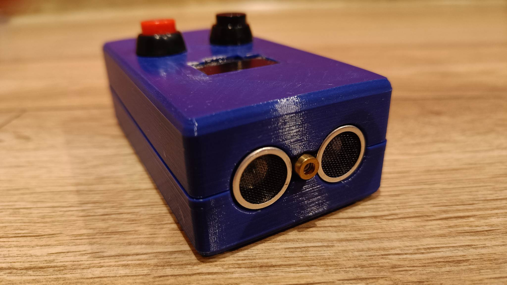

# Projekt dalmierza ultradźwiękowego  

Celem projektu było zaprojektowanie układu do pomiarów odległości. Pomiar dokonywany jest za pomocą czujnika ultradźwiękowego HC-SR04 2, odbierany i przetwarzany przez Arduino Nano, a następnie wyświetlany na ekranie OLED.  
  
  
Wykonany prototyp:  

